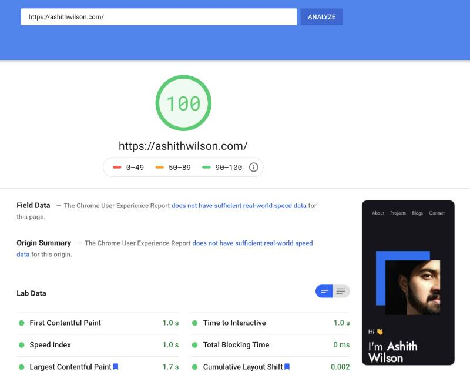
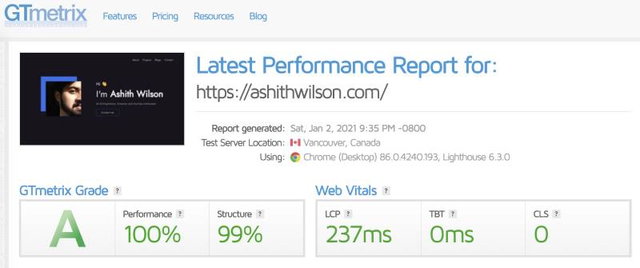

# Personal portfolio

<p align="center">
  
</p>

## Demo

### Live preview: [Ashith Wilson](https://ashithwilson.com)'s personal website.

## Getting Started

Download the .zip file from Github or run the below command to clone the repo locally.

```bash
git clone https://github.com/ashithwilson/ashithwilson.com.git
```

This project is using HTML and CSS only. Just update the HTML according to your needs.

## Page Optimization 🚀

* Edge cache via Cloudflare and cache purging Github action added.
* Critical CSS generated for faster page load and to prevent layout shift.

<p align="center">
  
  
</p>

## License

[MIT licensed](http://opensource.org/licenses/MIT)
